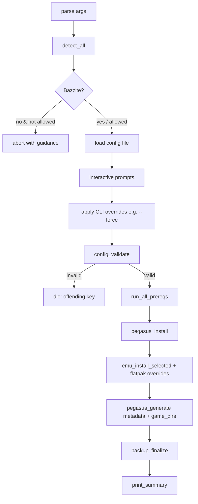

# Architecture

## Goal

Take a Bazzite (Fedora Atomic) machine and produce a working Pegasus Frontend +
emulator setup with **one command**, safely, repeatably, and reversibly — using
only user-space changes and Flatpak, never invasive `rpm-ostree` layering.

## Why Bash

The work is almost entirely orchestration of shell tools (`flatpak`, file
generation, path handling, OS probing). Bash is guaranteed present on Bazzite,
needs no runtime to install (which on an atomic OS would itself be a problem),
and keeps the UX a single `./scripts/deploy.sh`. We deliberately avoid `yq` and
other non-default tools so the script runs on a minimal Fedora userspace; a
small YAML-subset parser is implemented in `config.sh`.

## Components

```
scripts/
  deploy.sh        Entry point: arg parsing, orchestration, summary
  validate.sh      Post-deploy pass/fail health check
  restore.sh       Restore from a timestamped backup
  smoke-fedora-container.sh   Run the suite in a Fedora container
  lib/
    common.sh      Logging, colors, dry-run executor (run_cmd/write_file), prompts
    detect.sh      OS / atomic / form-factor detection (pure, fixture-testable)
    prereq.sh      Network/flatpak/disk/write/state checks
    config.sh      Defaults, YAML-subset parser, prompts, validation
    emulators.sh   Emulator catalog + Flatpak install + ROM-path overrides
    pegasus.sh     Pegasus install + config/metadata generation
    backup.sh      Timestamped backup + restore
config/
  example-config.yaml   Documented non-interactive config
  systems/*.conf        Data-driven system definitions (one per system)
```

The libraries are sourced by every entrypoint; they define functions and set
state globals but have no side effects at source time, so the test suite can
source them and exercise pure functions in isolation.

## Control flow (`deploy.sh main`)



Every state-changing action flows through `run_cmd`/`write_file` in `common.sh`,
which in `--dry-run` print the action instead of executing it. This makes
dry-run correct *by construction* — there is no second code path to drift.

## Configuration model

- **Defaults** (`config_set_defaults`) → overridden by **config file**
  (`parse_config_file`) → overridden by **interactive prompts** → overridden by
  **CLI flags** (e.g. `--force`). CLI always wins; this precedence is applied
  explicitly in `main` after prompts.
- Booleans accept `yes/no/true/false/1/0`. Validation fails fast and names the
  offending key.

## Data model

Systems are **data, not code**: `config/systems/<short>.conf` defines name,
shortname, ROM-dir name, default emulator, file extensions, and (for RetroArch)
the libretro core. Adding a system is a new `.conf` file — no script edits.

Emulators are a **catalog** in `emulators.sh` (Flathub id + launch template +
caveat note). The launch template carries Pegasus variables (`{file.path}`)
literally so Pegasus expands them at launch; `{CORE_PATH}` is substituted at
generation time for RetroArch.

## The two non-obvious correctness details

1. **Sandbox ROM access.** A Flatpak emulator cannot read the ROM directory
   unless granted: `flatpak override --user <app> --filesystem=<rom_root>`. We
   apply this to every selected emulator (and to Pegasus itself when it is a
   Flatpak), plus any `extra_rom_paths` (SD cards, externals).
2. **Cross-sandbox launching.** When Pegasus is a Flatpak, it cannot directly
   run another Flatpak. Launch lines are prefixed with `flatpak-spawn --host`
   and Pegasus is granted `--talk-name=org.freedesktop.Flatpak`. When Pegasus is
   native/AppImage, no prefix is used.

## Backup / restore model

Before overwriting any file, `backup_file` copies it under
`$XDG_DATA_HOME/pegasus-bazzite-configurator/backups/<timestamp>/files/<abs-path>`
and appends to `manifest.tsv` (`relative\toriginal`). One backup dir per run
(`backup_begin` is idempotent within a run and sets a **shell global**, never via
a subshell). `restore.sh` replays the manifest.

## Logging model

`log_init` opens `…/logs/deploy-<timestamp>.log`. Everything is timestamped;
INFO/OK go to stdout, WARN/ERROR to stderr (and all to the log). Dry-run actions
are logged with a `[DRYRUN]` tag. `log_error` sets `PBC_HAD_ERRORS` so `main`
can exit non-zero while still finishing and summarizing.

## Error handling

`set -Eeuo pipefail` + an `ERR` trap reporting file:line. Expected failures are
handled explicitly (`|| log_error`, `|| die`) so the trap only fires on genuine
bugs. CLI exit codes: `0` success, `1` completed-with-errors / fatal, `2` usage.

## Testing model

- **Unit tests** (`tests/run-tests.sh`): pure functions against fixtures
  (os-release parsing, YAML parsing, quoting, launch-line generation, validation,
  backup-path).
- **ShellCheck**: entrypoints are linted with `external-sources` so the whole
  sourced graph is analysed.
- **Fedora container smoke test**: end-to-end dry-run + generation + validation
  in a Fedora image, including a ROM path containing spaces and the
  flatpak-absent path.

See [TESTING.md](TESTING.md) for the boundary between what is smoke-tested and
what needs real Bazzite.

## Extension points

- New system → drop a `config/systems/*.conf`.
- New emulator → add an entry to the `emulators.sh` catalog and reference it from
  a system's `SYS_EMULATOR`.
- New config key → add to `config_set_defaults`, `_yaml_key_to_cfg`,
  `config_validate`, and document it in `example-config.yaml`.

## Known limitations / trade-offs

- The YAML-subset parser supports scalars, inline comma lists, and block
  sequences — not arbitrary YAML. This is intentional (no dependency).
- Runtime behaviour (launching, Game Mode, real sandbox) cannot be proven off
  real hardware.
- We never auto-download AppImages or third-party binaries; AppImage install is a
  documented manual step. (`install-cores.sh` is the one opt-in downloader, pinned
  to the official libretro buildbot with zip validation.)
- One helper (`add-to-steam.sh`) uses a small stdlib-`python3` module for Steam's
  **binary** `shortcuts.vdf` — binary parsing in bash would be unsafe. `python3`
  ships in the Fedora/Bazzite base, so this adds no install step; everything else
  stays pure bash.
